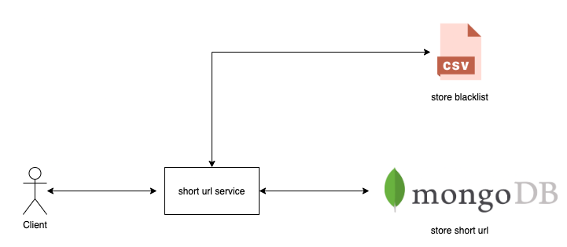
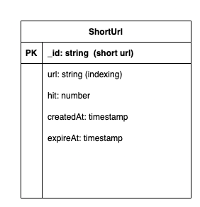
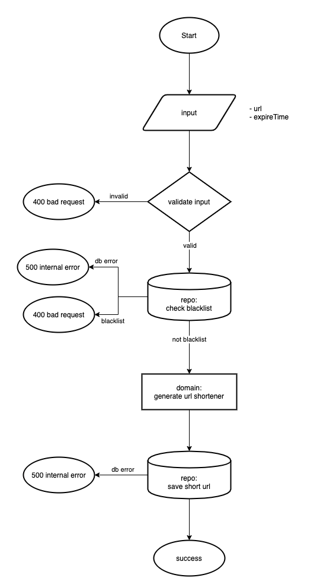
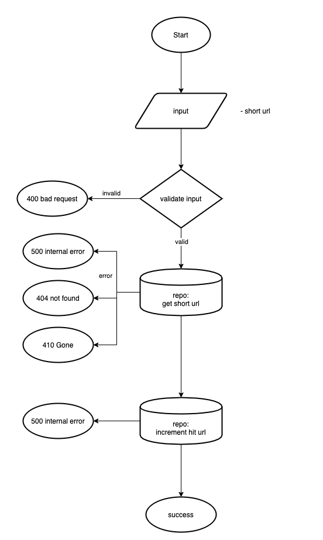
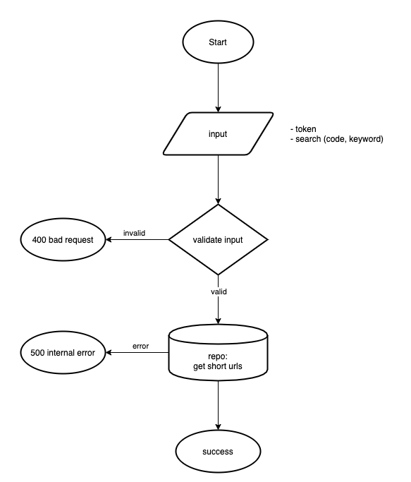
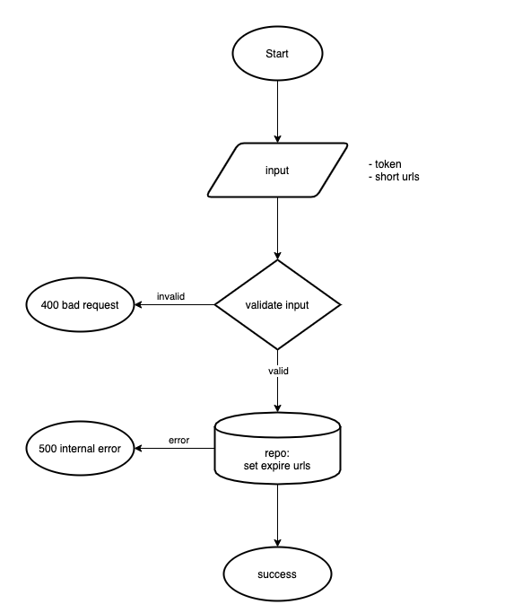

# Short url service

## System Design



## Database Design



## Logic generate short url

### 1) timestamp + _ + url
```1618474714310_https://www.google.com```

### 2) MD5(timestamp + _ + url)

```24e71c14c8c0de5d71b02b9c0b0d34f1```

### 3) Cut first 6 charater

```24e71c```

## Usage

- ```make setup``` (start db)
- ```source development/dev.env``` (setup env)
- ```make dev```

## MakeFile Command

- make gen (generate mock)
- make test (testing)
- make build (build binary file)
- make run (build execute binary)
- make setup (start db)

## Service

### Create short url



### Get short url



### Admin get short url



### Admin delete short url


